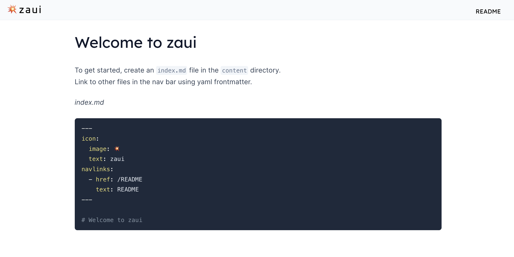

# zaui
The npm-installable SvelteKit toolchain.
Generate a website from markdown with a minimum of fuss.

1. `pnpm install -S @zeroasic/zaui`
2. `pnpm zaui dev`
3. Type `o` to open your browser.



### This library provides``

- A preconfigured [SvelteKit](https://kit.svelte.dev/docs/introduction) app with a [Vite](https://vitejs.dev/) dev server and build.
- [Tailwind CSS](https://tailwindcss.com/docs/installation), and the [Tailwind typography](https://tailwindcss.com/docs/typography-plugin) plugin.
- Markdown rendering based on [Markdoc](https://github.com/markdoc/markdoc).
- A set of built-in website navigation and page components.
- A way to customize the design, and add your own Svelte components.
- Static publishing using the SvelteKit [static adapter](https://kit.svelte.dev/docs/adapter-static).
- TypeScript

### Coming soon

- Contact and newsletter forms
- User signup and authentication.

### Background

The name 'zaui' originated from "Zero ASIC UI", where it powers the [zeroasic.com](https://www.zeroasic.com/) website.

Inspiration for the developer experience of zaui came from [VitePress](https://vitepress.dev/). The main achitectural difference is that zaui can fetch and render markdown dynamically in the browser, similar to [docsify](https://docsify.js.org/#/?id=what-it-is).

### Installation
Use npm, pnpm, or yarn. E.g.

`npm install -D @zeroasic/zaui`

### Usage
- `zaui dev` launches a dev server to render a preview of the website while you edit content.
- `zaui build` produces a static build of the website files.

The zaui project directory can be passed as an argument E.g. `zaui dev docs` when your zaui project lives in the `docs` subdirectory of your repo.

For non-global installs, these commands should be added as package.json scripts E.g.

```json
  "scripts": {
    "dev": "zaui dev",
    "build": "zaui build"
  }
```

### Directories
You can override the default directories with env vars. More details in [zaui.js](bin/zaui.js)

- ZAUI_PROJECT_DIR defaults to current working directory, with other directories below that.
- ZAUI_CONTENT_DIR is where markdown files live - defaults to `./content`
- ZAUI_BUILD_DIR is where build output is written - defaults to  `./build`
- ZAUI_SRC_DIR: is optional, where custom components live - defaults to `./src`
