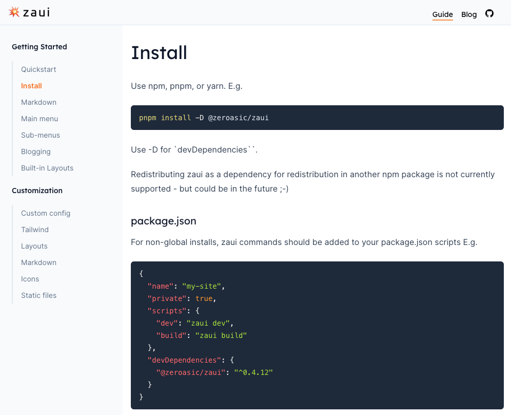

# Hello zaui
We are thrilled to announce the open source release of [zaui](https://github.com/zeroasiccorp/zaui), our npm-installable SvelteKit toolchain for building websites from markdown with a minimum of fuss.

The name 'zaui' originated from "Zero ASIC UI", where it powers the [zeroasic.com](https://www.zeroasic.com/) website.

### Quickstart
You can use pnpm, or npm, or yarn.

1. `pnpm install -D @zeroasic/zaui`
2. `pnpm zaui dev`
3. Type `o` to open your browser.

If you don't already have a `content` directory you will see the zaui guide -- rendered by zaui, of course.

### This library provides

- A preconfigured [SvelteKit](https://kit.svelte.dev/docs/introduction) app with a [Vite](https://vitejs.dev/) dev server and build.
- [Tailwind CSS](https://tailwindcss.com/docs/installation), and the [Tailwind typography](https://tailwindcss.com/docs/typography-plugin) plugin.
- Markdown rendering based on [Markdoc](https://github.com/markdoc/markdoc).
- A set of built-in website navigation and page components.
- A way to customize the design, and add your own Svelte components.
- Static publishing using the SvelteKit [static adapter](https://kit.svelte.dev/docs/adapter-static).
- TypeScript

Thank you to all the contributors in those communities.

# 🙏🙏