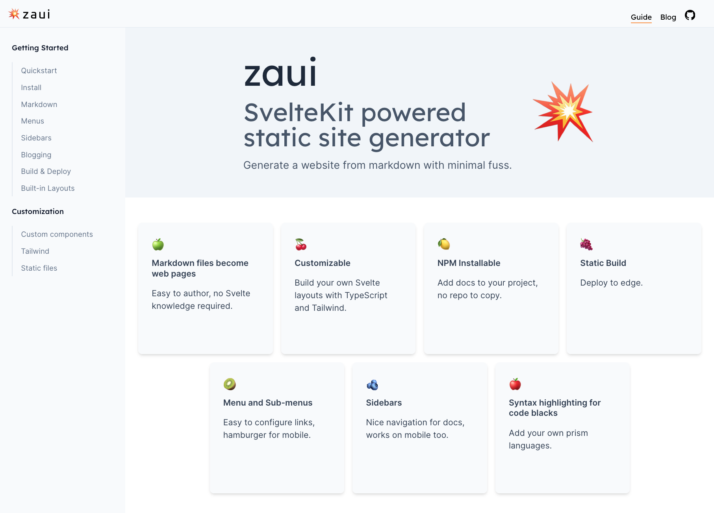

# Zaui, our npm-installable SvelteKit toolchain

_Originally published at [https://www.zeroasic.com/blog/zaui-release](https://www.zeroasic.com/blog/zaui-release)._

We are pleased to announce the open source release of [zaui](https://github.com/zeroasiccorp/zaui), our npm-installable SvelteKit toolchain for building websites from markdown.

The name *zaui* originated from "Zero ASIC UI", where it powers the [zeroasic.com](https://www.zeroasic.com/) website.

### How we use zaui

Zaui was instrumental in shipping our [drag-and-drop chiplet emulation UI](https://www.zeroasic.com/emulation) using custom Svelte components. The zeroasic.com website is statically generated by zaui and hosted on a CDN. In addition, the build is integrated into our internal python-based emulation tools, which handle requests through an API.

### Quickstart

1. `pnpm install -D @zeroasic/zaui`
2. `pnpm zaui dev`
3. Type `o` to open your browser.

If you don't already have a `content` directory you will see the [zaui guide](https://zaui.zeroasic.com/guide/quickstart) -- rendered by zaui, of course.

### This library provides

- A preconfigured [SvelteKit](https://kit.svelte.dev/docs/introduction) app with a [Vite](https://vitejs.dev/) dev server and build.
- [Tailwind CSS](https://tailwindcss.com/docs/installation), and the [Tailwind typography](https://tailwindcss.com/docs/typography-plugin) plugin.
- Markdown rendering based on [Markdoc](https://github.com/markdoc/markdoc).
- A set of built-in website navigation and page components.
- Static publishing using the SvelteKit [static adapter](https://kit.svelte.dev/docs/adapter-static).
- TypeScript

Thank you to all the contributors in those communities. 🙏

To find out more, visit the [zaui](https://github.com/zeroasiccorp/zaui) repo on GitHub or check out the [guide](https://zaui.zeroasic.com/guide/quickstart).