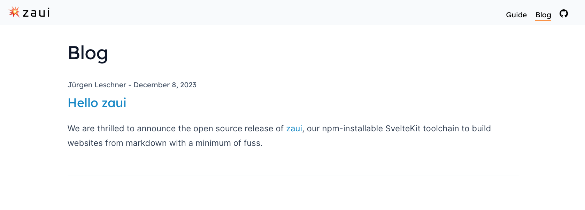
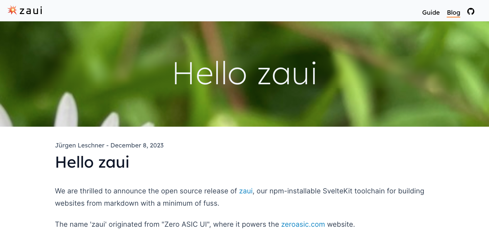

# Blogging

Blog posts are authored in the content/blog directory. Each post should have a title and `yyyy-mm-dd` date in the frontmatter. Splash image, author, and excerpt are optional.

```yaml
---
title: Zaui, our npm-installable SvelteKit toolchain
author: Jürgen Leschner
splash:
  image: images/daisy.jpg
date: 2023-12-09
excerpt: |
  We are pleased to announce the open source release of [zaui](https://github.com/zeroasiccorp/zaui), our npm-installable SvelteKit toolchain for building websites from markdown.
---

# Hello zaui
```



