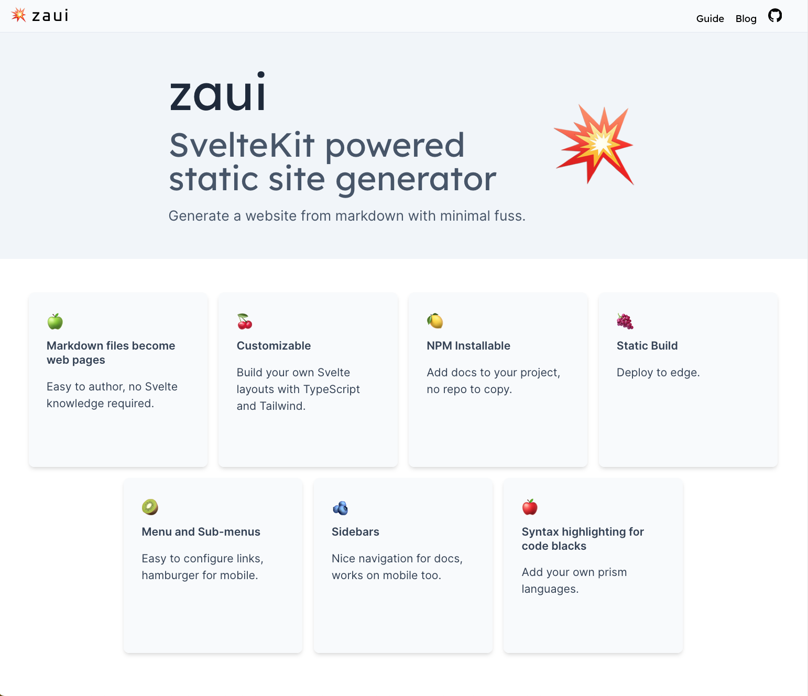

# Landing Page

The landing page design was inspired by [VitePress](https://vitepress.dev/) -- thank you Evan -- with a Hero section at the top and Feature boxes below that.

Use `hero` and `features` in your index.md frontmatter to configure each section. Icon configuration follows the same pattern as in the [menus](menus). Note that `hero` looks best combined with `fullwidth: true`, which allows the layout to take up the full width of the window, with no padding or margins.

Example from [here](https://github.com/zeroasiccorp/zaui/blob/main/static/files/index.md?plain=1). 


### index.md

```yaml
hero:
  name: zaui
  text: SvelteKit powered static site generator
  tagline: Generate a website from markdown with minimal fuss.
  icon: 💥
  actions:
    - text: Quickstart
      link: /guide/quickstart
    - text: GitHub
      link: https://github.com/zeroasiccorp/zaui

fullwidth: true

features:
  - icon: 🍏
    text: Markdown files become web pages
    details: Easy to author, no Svelte knowledge required.
    href: /guide/quickstart
  - icon: 🍒
    text: Customizable
    details: Build your own Svelte layouts with TypeScript and Tailwind.
    href: /guide/custom-components
  - icon: 🍋
    text: NPM Installable
    details: Add docs to your project, no repo to copy.
    href: /guide/quickstart
  - icon: 🍇
    text: Static Build
    details: Deploy to edge.
    href: /guide/build-and-deploy
  - icon: 🥝
    text: Menu and Sub-menus
    details: Easy to configure links, hamburger for mobile.
    href: /guide/menus
  - icon: 🫐
    text: Sidebars
    details: Nice navigation for docs, works on mobile too.
    href: /guide/sidebars
  - icon: 🍎
    text: Syntax highlighting for code blacks
    details: Add your own prism languages.
    href: /guide/static-files
```
