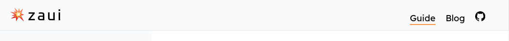
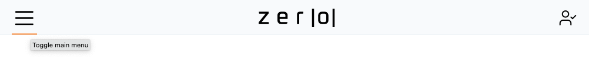
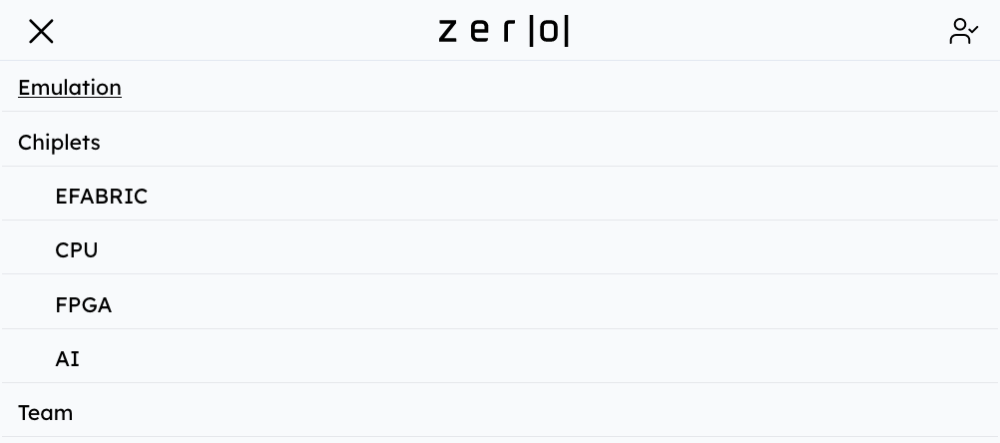
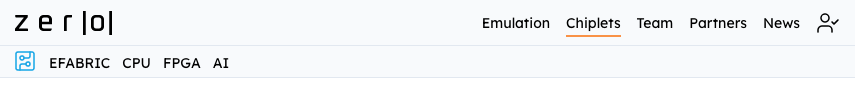

# Menu configuration

Links and icons in the main menu are configured in the frontmatter of `index.md`. E.g.



```yaml
icon:
  image: 💥
  text: zaui

navlinks:
  - text: Guide
    href: /guide/quickstart
  - text: Blog
    href: /blog
  - text: GitHub
    href: https://github.com/zeroasiccorp/zaui
    icon: GitHub
```

The icon.image can be an emoji or a reference to an image file.

## Small screens

Navlinks will be collapsed behind a "hamburger" menu on small screens.





## Sub-menus

Nested `submenu` links will be expanded under the main menu bar. E.g.



```yaml
  - href: /chiplets
    text: Chiplets
    submenu:
      icon: CircuitBoard
      links:
        - text: EFABRIC
          href: /chiplets/efabric
          icon: Grid
          image: /chiplets/images/efabric-diagram.svg
        - text: CPU
          href: /chiplets/cpu
          icon: Cpu
          image: /chiplets/images/cpu-diagram.svg
        - text: FPGA
          href: /chiplets/fpga
          icon: CircuitBoard
          image: /chiplets/images/fpga-diagram.svg
        - text: AI
          href: /chiplets/ai
          icon: BrainCircuit
          image: /chiplets/images/ai-diagram.svg
```


