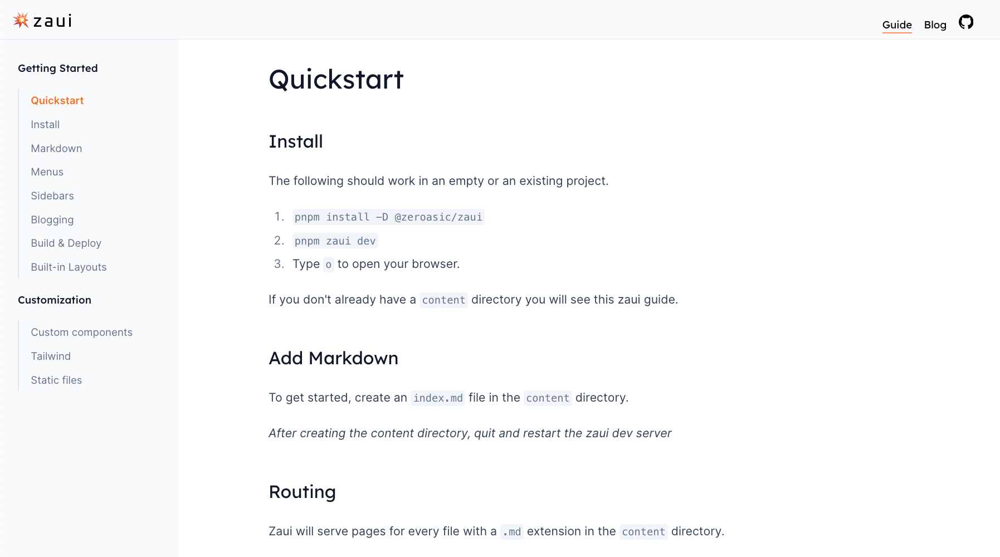
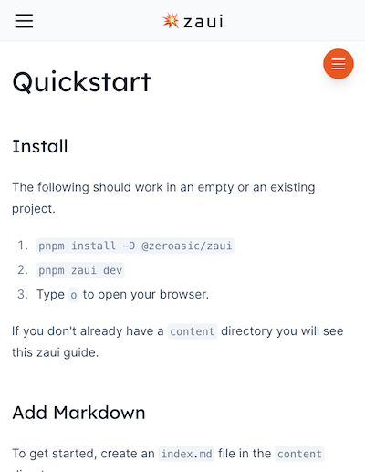
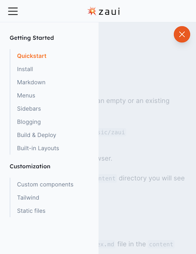

# Sidebars

Sidebar navigation is configured in `sidebars` in your index.md frontmatter.

The sidebar will show up for any page whose URL starts with the top level href for the sidebar. In the example below, that is all `/guide` pages.


```yaml
sidebars:
  - text: Guide
    href: /guide
    sections:
      - text: Getting Started
        links:
          - text: Quickstart
            href: /guide/quickstart
          - text: Install
            href: /guide/install
          - text: Markdown
            href: /guide/markdown
          - text: Menus
            href: /guide/menus
          - text: Sidebars
            href: /guide/sidebars
          - text: Blogging
            href: /guide/blogging
          - text: Build & Deploy
            href: /guide/build-and-deploy
          - text: Built-in Layouts
            href: /guide/built-in-layouts
      - text: Customization
        links:
          - text: Custom components
            href: /guide/custom-components
          - text: Tailwind
            href: /guide/custom-tailwind
          - text: Static files
            href: /guide/static-files
```

On full-width displays, the sidebar is located next to the content.



On narrower displays, the sidebar will overlay the content, and has to be opened and closed using the sidebar open/close button on the right.



