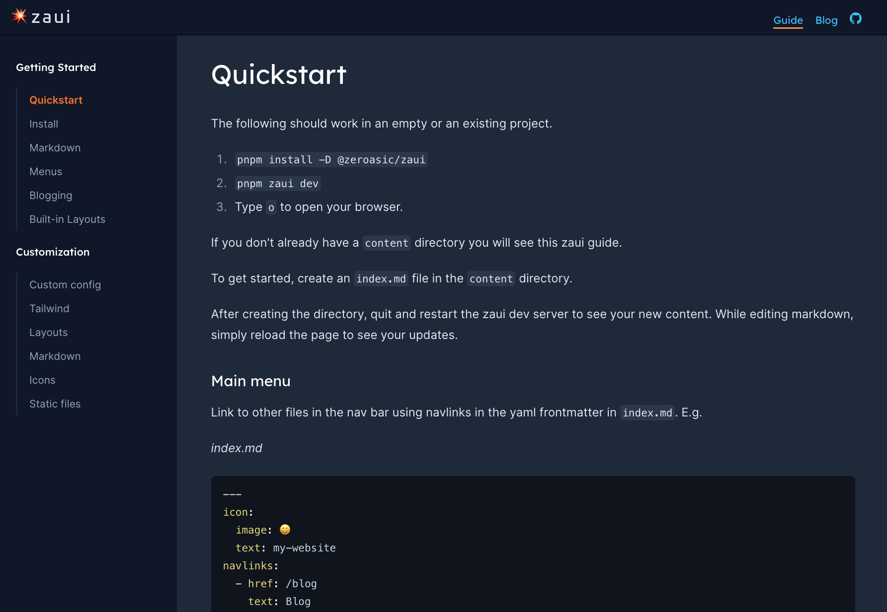

---
icon:
  image: 💥
  text: zaui
navlinks:
  - text: Guide
    href: /guide/quickstart
  - text: Blog
    href: /blog
  - text: GitHub
    href: https://github.com/zeroasiccorp/zaui
    icon: GitHub
sidebars:
  - text: Guide
    href: /guide
    sections:
      - text: Getting Started
        collapsed: false
        links:
          - text: Quickstart
            href: /guide/quickstart
          - text: Install
            href: /guide/install
          - text: Markdown
            href: /guide/markdown
          - text: Menus
            href: /guide/menus
          - text: Blogging
            href: /guide/blogging
          - text: Built-in Layouts
            href: /guide/built-in-layouts
      - text: Customization
        collapsed: true
        links:
          - text: Custom config
            href: /guide/custom-config
          - text: Tailwind
            href: /guide/custom-tailwind
          - text: Layouts
            href: /guide/custom-layouts
          - text: Markdown
            href: /guide/custom-markdown
          - text: Icons
            href: /guide/custom-icons
          - text: Static files
            href: /guide/static-files
splash:
  image: images/station-clouds.jpg
  title: Welcome to zaui
  subtitle: The npm-installable SvelteKit toolchain.
---

#### Please see the [Quickstart Guide](/guide/quickstart) to get started.

